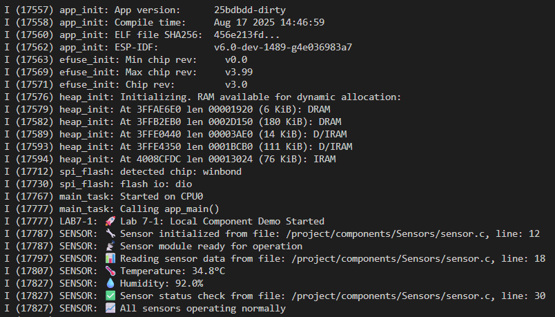

# Lab 7-1: Local Component Demo

## คำอธิบาย
การทดลองนี้แสดงการใช้งาน component ที่มีอยู่ในโฟลเดอร์ `components/Sensors/` ของ project

## สรุปคำสั่งที่ใช้ และผลลัพธ์ที่ได้

เริ่ม Docker container แบบ background
docker-compose up -d

ตรวจสอบ container
docker-compose ps -a

เข้าใช้งาน container
docker exec -it esp32-lab7 bash

เข้าไปยังโฟลเดอร์ project
cd lab7-1_Managed_Local_Component

Export environment ESP-IDF
. $IDF_PATH/export.sh

กำหนด target ESP32
idf.py set-target esp32

Build project
idf.py build

ทดสอบการทำงานและผลลัพธ์

idf.py qemu 

